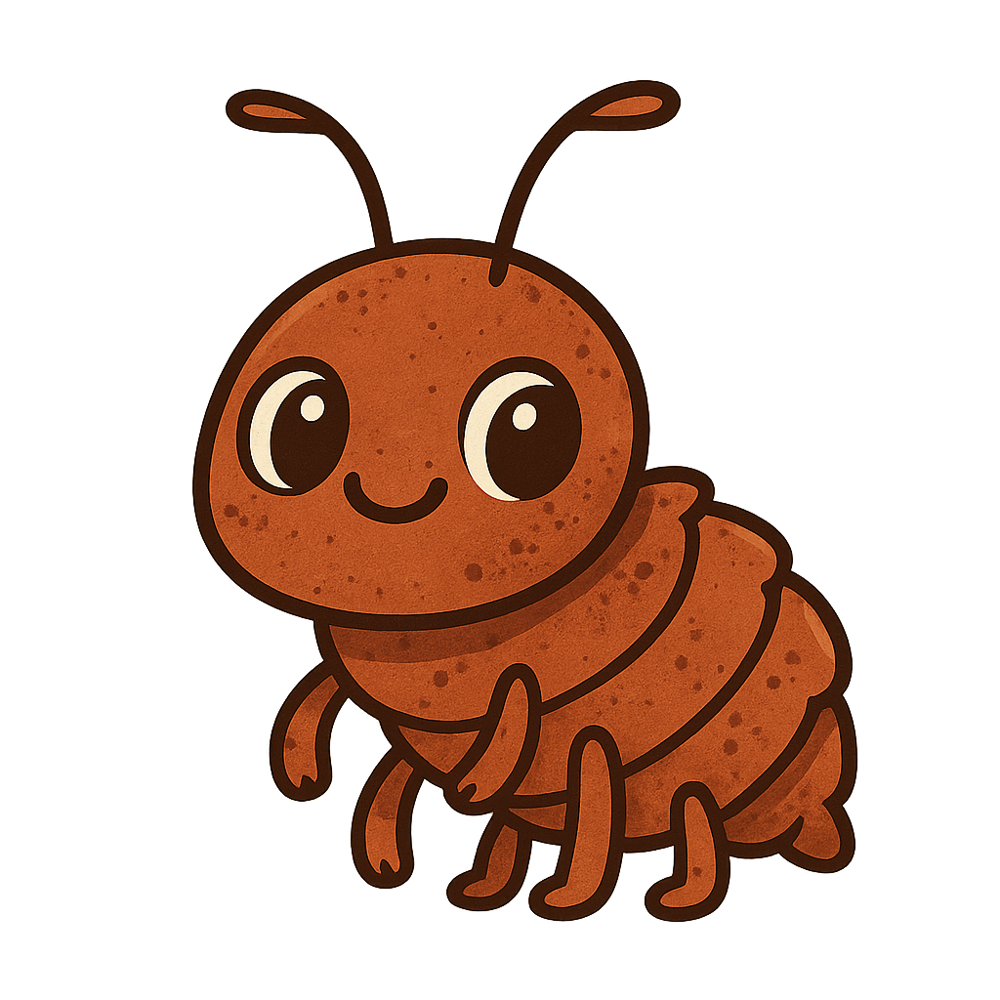

<p align="center">
  
</p>

# rs-licer

A simple STL ray-tracing slicer written in Rust with a cross-platform GUI.

## Requirements

- Rust toolchain (no system dependencies needed!)

## Building

```bash
cargo build --release
```

This creates the executable at `target/release/rs-licer`

## Usage

### GUI Mode

```bash
./target/release/rs-licer --gui
# or
cargo run -- --gui
```

The GUI provides:
- File browser for selecting input STL files
- Text inputs for output directory, pixel size, and layer height
- Checkboxes for zero slice position, delete below zero, and delete output directory options
- Real-time progress bar with percentage
- Estimated time to completion
- Slice button to start processing

**Cross-platform:** Works on Windows, macOS, and Linux without any external dependencies!

### Headless Mode

Run the slicer from the command line:

```bash
# Basic usage
./target/release/rs-licer model.stl output/

# With custom settings
./target/release/rs-licer -p 50 -l 25 model.stl slices/

# Using cargo
cargo run -- model.stl output/
```

#### Command Line Options

```
rs-licer - STL slicer for resin 3D printing

USAGE:
    rs-licer --gui
    rs-licer [OPTIONS] <INPUT_STL> <OUTPUT_DIR>

ARGS:
    <INPUT_STL>     Path to input STL file
    <OUTPUT_DIR>    Directory to output slice images

OPTIONS:
    --gui                      Launch GUI mode
    -h, --help                 Print help information
    -p, --pixel-size <UM>      Pixel size in micrometers (default: 33.3333)
    -l, --layer-height <UM>    Layer height in micrometers (default: 20.0)
    --zero-slice-position      Position model at slice zero (default: false)
    --keep-above-zero          Keep slices above zero (default: delete below zero)
    --keep-output-dir          Don't delete existing output directory (default: delete)
    --open-output-dir          Open output directory when done (default: false)
```

## Configuration Options

- **Input Path**: Path to the STL file to slice
- **Output Directory**: Directory where slice PNG images will be saved
- **Pixel Size (μm)**: Size of each pixel in micrometers
- **Layer Height (μm)**: Height of each layer in micrometers
- **Zero Slice Position**: Whether to zero the slice position
- **Delete Below Zero**: Whether to skip slices below Z=0
- **Delete Output Directory**: Whether to delete the output directory before slicing (default: true)

---

<p align="center">
  
</p>
